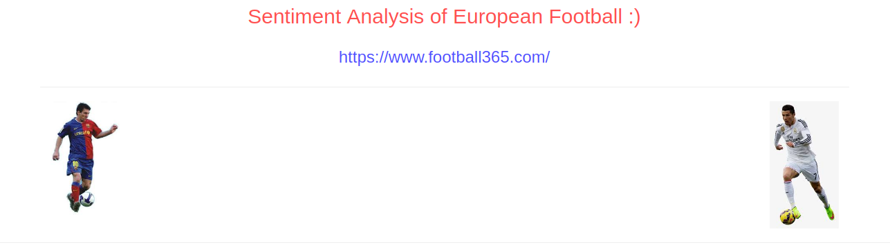
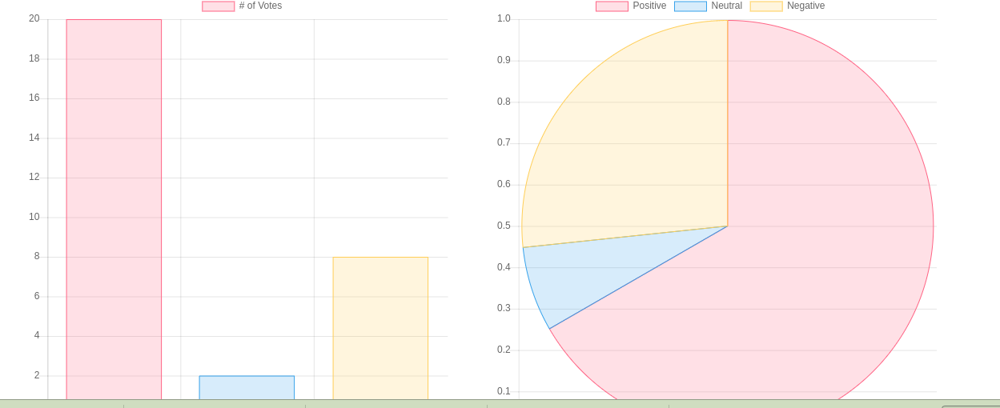

#Sentiment Analysis Of European Football

This is sentiment Analysis of European Football Using TextBlob Python and Chart.js
Here, data are collected by Scarping wing Beautifulsoup Python library .
I make this project using DjangoFrameWork

#Requirements
* Python2.7 or more
* pip install django
* setup Django Project
* pip install BeautifulSoup
* pip install TextBlob
* pip install  requests

#Data from
[Click :](https://www.football365.com/)

##Some ScreenShots

